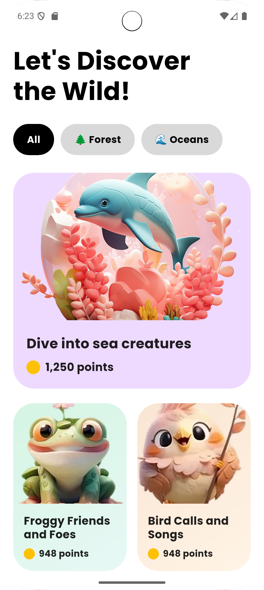
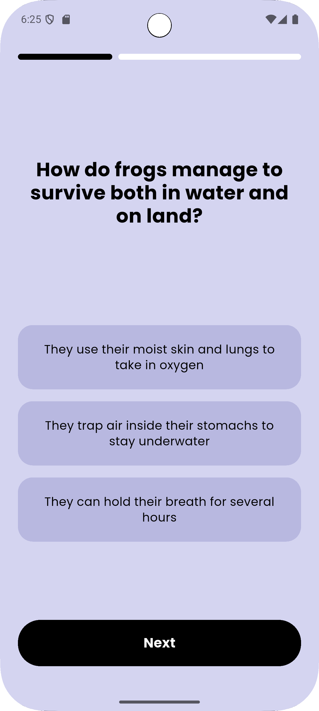

# 🐝 Mowlo
**Mowlo** is a fun and educational wildlife quiz app built with **Flutter**.  
It helps users explore the animal world through interactive quizzes with a clean and modern design.

---

## 💻 Developer Info
- **Name:** Khairunnisa Siregar  
- **NIM:** 231401118  
- **Lab:** Pemrograman Mobile 2

---

## 📱 Application Overview
- **App Name:** Mowlo  
- **Platform:** Flutter  
- **Main Concept:** Wildlife-themed quiz app  
- **Core Idea:** Learn about animals and nature through fun, quick quizzes.  

---

## 📝 Description
Mowlo introduces an engaging way to test your knowledge about animals.  
Users can take short quizzes about wildlife while enjoying a visually appealing interface inspired by modern mobile design trends.  

The app contains:
- **Welcome Screen** – entry page before the main dashboard  
- **Dashboard** – quiz category list and navigation  
- **Quiz Screen** – interactive multiple-choice quiz  
- **Result Screen** – final score summary 

---

## 🎨 Design Inspiration & Mockup
The UI design for Mowlo is inspired by clean, playful, and nature-themed mobile concepts.

**Design References:**
- [QuizWiz – Concept of Quiz App (Dribbble)](https://dribbble.com/shots/22378846--QuizWiz-Concept-of-quiz-app)  
- [Inspirational Pinterest Board](https://pin.it/63skTUlXv)

**Mockup Prototype:**
- [Figma Design – Mowlo App](https://www.figma.com/design/eYg71cZe0gBItO8wI0lQjg/Mowlo--App?node-id=0-1&t=U3WWiPUuBLhZRT56-1)

---

## 📸 Screenshots / Video Demo
| Dashboard | Quiz | Result |
|------------|------|--------|
|  |  |  |

---

## 🎯 Features
✅ 4 main screens (Welcome, Dashboard, Quiz, Result)  
✅ Clean and responsive UI using **Poppins** font  
✅ Local data for quiz questions  
✅ Progress indicator and result calculation  
✅ Modular structure with reusable widgets  
✅ Simple quiz logic with Provider state management  

---

## 🧰 Tech Stack
- Flutter  
- Dart  
- Provider (state management)  
- Material Design  
- Google Fonts – Poppins  

---

## 🚀 How to Run
1. Clone this repository  
   ```bash
   git clone https://github.com/<your-username>/mowlo.git
   cd mowlo
2. Install dependencies
   flutter pub get
3. Run the app
   flutter run

---

**🙌 Credits**

Icons: Font Awesome

Fonts: Poppins (Google Fonts)

Design Inspiration: Dribbble & Pinterest

Mockup: Figma – Mowlo App by Khairunnisa Siregar

---

**🏁 Final Notes**

This project was developed for UTS Pemrograman Mobile Lab 2.
Mowlo showcases how simple quizzes can become an engaging educational experience through good UI, structured logic, and clear design identity.

---

© 2025 Khairunnisa Siregar | Universitas Sumatera Utara
